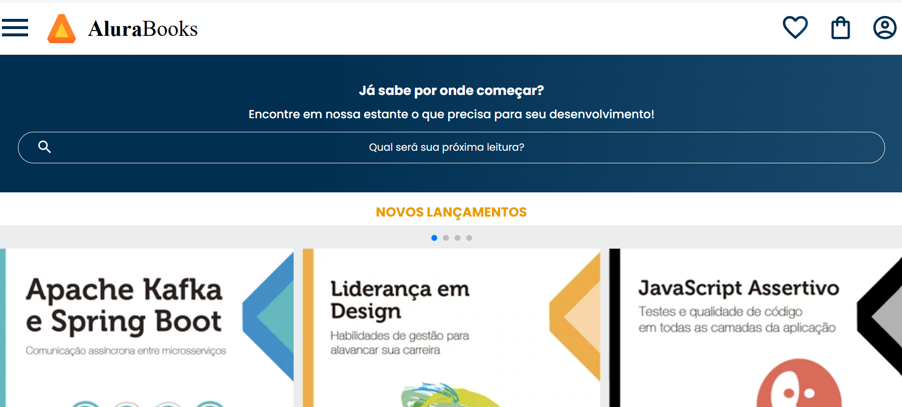

# AluraBooks

AluraBooks é um projeto front-end que simula uma plataforma de venda de livros. Este projeto foi desenvolvido como parte de um curso, com foco em criar uma página estática que apresenta conceitos básicos de HTML e CSS, incluindo um carrossel de imagens.

## Demonstração



## Tecnologias Utilizadas

- HTML
- CSS

## Funcionalidades

- **Página Inicial**: Apresenta os livros disponíveis para venda.
- **Carrossel de Imagens**: Mostra os livros em destaque de forma interativa.
- **Design Responsivo**: A página se adapta a diferentes tamanhos de tela.


## Como Executar o Projeto

1. Clone o repositório:
   ```bash
   git clone https://github.com/seu-usuario/AluraBooks.git
   cd AluraBooks


